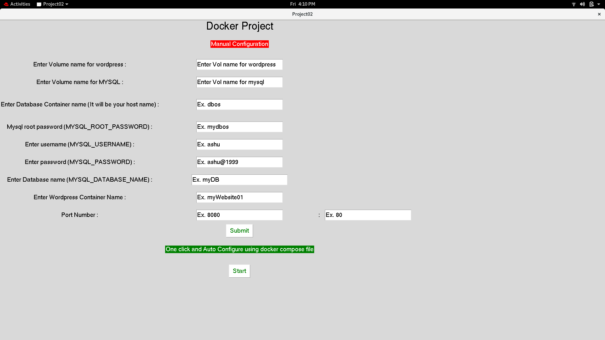
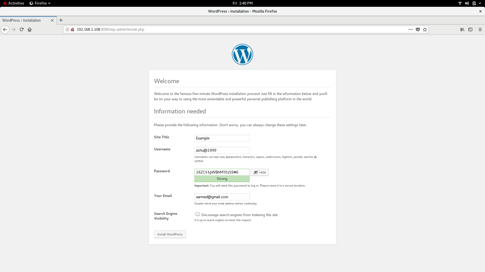
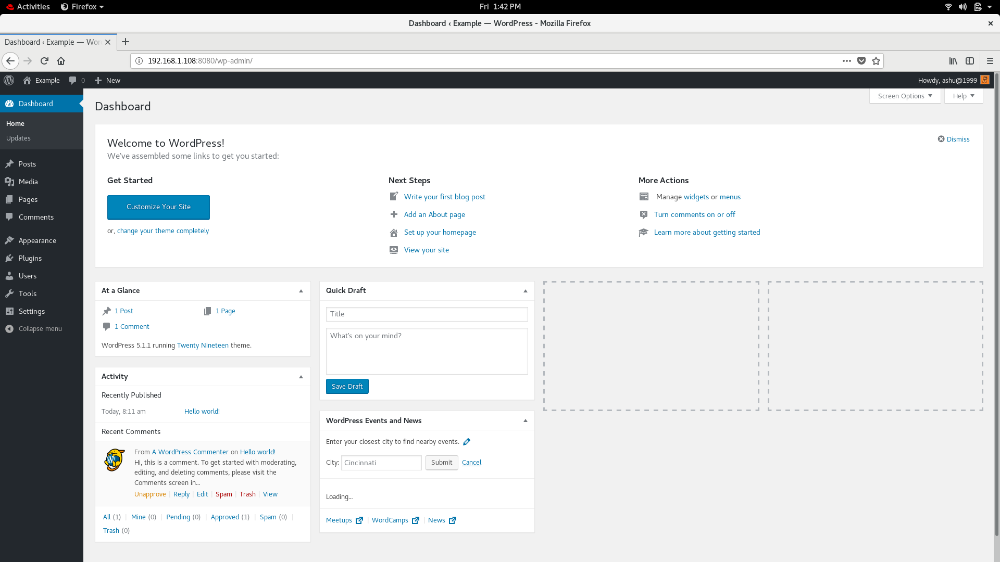
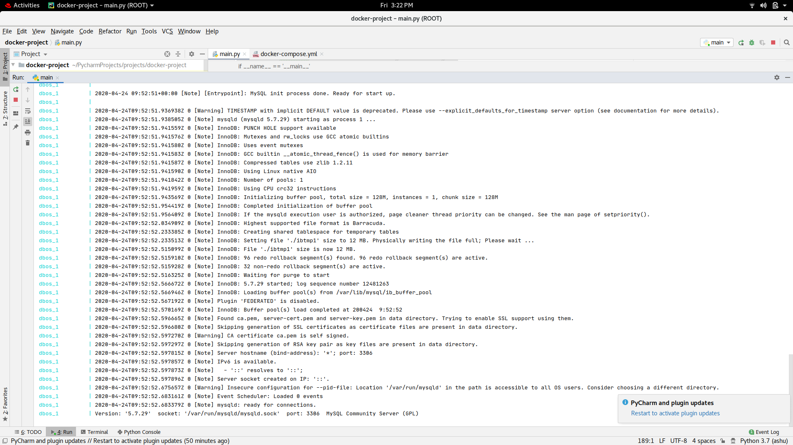

# Docker Project
1. Mannual Config

- mysqlContainerName > MySQL Container name
- mySQLUsername > Username
- mySQLPassword > User's password
- mySQLDatabase > DB name
- createVolWordpress  > Volume name for Wordpress
- wordpressContainerName > Wordpress Container name
- portNumber > ex. 8080
- portNumber2 > ex. 80
- mysqlContainerName > MySQL Container name

2. Automatic COnfig

but In automatic config., you don't have to put all these thing, Just one click start and one click stop. I've use docker compose here.

Here is the screenshot 1, 

Screenshot 2,

Screenshot 3,

Screenshot 4,

